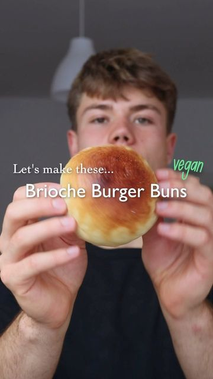

# VEGAN BRIOCHE BURGER BUNS 🍔🌱 so soft and delicious! 

> recipe by [@herbifoods](https://www.instagram.com/herbifoods/) 
(Paul Köber) - [see original post](https://instagram.com/p/CVdWPkBqGXh)

⠀  
Trust me, after having made these buns once you'll never want to go back to the dry store-bought burger buns... I made these for my recent beet burgers and wow, that was by far the best burger I ever had, not least because of these delicious rolls! 😍 Full credits for this amazing recipe go to @eatthisorg!   
⠀  
RECIPE (8 buns)  
- 4 cups (500 g) all purpose flour  
- 145 ml plant milk  
- 145 ml water  
- 7 g dry yeast  
- 8 g salt  
- 50 g vegan butter  
Toppings:  
- 3 tbsp butter  
- 1 tbsp maple syrup  
- 1 tbsp plant milk  
- 2 tbsp sesame seeds (optional)  
⠀  
❶ Make the tangzhong. Bring 60 ml of the milk to a boil and whisk in 30 g of the flour until you have a lump-free pulp. Set aside and let it cool to 30-40 °C. This will make the buns more soft and tender and they will stay fresh for a longer time.  
❷ Mix all the ingredients for the dough, kneed well for 10-15 minutes until you have a homogenous dough.   
❸ Cover with a wet kitchen towel and let it rest for 1 hour until it has doubled in size.  
❹ Form about 8 rolls. Try to get as much surface tension as possible and put them on a baking tray. Let the rolls rest for another 30 minutes.  
❺ Preheat the oven to 190 °C. Place a bowl with water in the oven, the steam resulting steam ensures that the starch in the dough surface gelatinizes and quickly solidifies.  
❻ Mix together the butter, maple syrup and plant milk for the glaze. Brush the rolls and optionally add some sesame seeds on top.  
❼ Bake for 15 minutes at 190°C!  
Try it yourself and tag me @herbifoods ✨ I just love seeing your remakes so much!  
⠀  
TIPS  
- you can make these in advance and freeze the buns for as long as you please!  
⠀   
NUTRION (per bun)  
470 kcal  
11 g protein  
76 g carbohydrates  
11 g fats  
3 g fiber  
Obviously these are not the healthiest buns out there, but like everything, nothing to worry about as part of an overall healthy diet!  
••  
Follow @herbifoods for more simple recipes!  
Much love to all of you, Paul 👋💚  
⠀  
\#vegan \#brioche \#veganrecipes \#easyrecipes \#veganbaking   