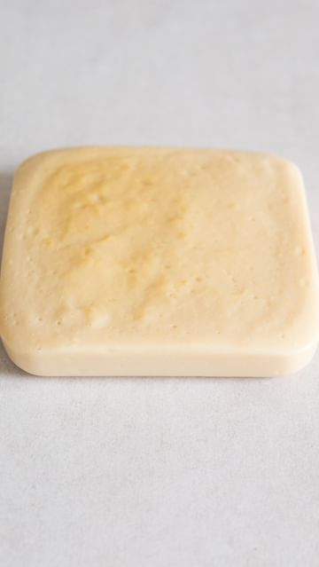

# Ep. 01 Local Kitchen - Chickpea Tofu 

> recipe by [@hermann](https://www.instagram.com/hermann/) 
(Julius Fiedler) - [see original post](https://instagram.com/p/CcFQjo0oftf)

  
In this series, I am localising cultural classics for a more sustainable diet. And what better food to start with than tofu?  
  
Usually made with soybeans, tofu originated in China and is widely used in many traditional dishes or often as a protein replacer of meat/fish. Soybeans have an incredibly high protein content, which make them the perfect legume for tofu. But you can also extract the protein and bind it into a soft block from other protein-rich legumes, like chickpeas. The methods vary slightly, as with traditional tofu you’d introduce acidity, which, similar to cheese, makes the liquid curdle, giving you the chance to strain and press It into a firm block. With chickpeas, the protein helps to set the tofu into a soft gelatinous block, also known as Burmese tofu.  
  
I used locally grown @hodmedods’ chickpeas, harvested from the Breckland soils of Norfolk, to turn this into a British tofu. No air miles, and using a crop that’s grown in the UK only since 2019! This is what plant-based food should be about in the future. Learning from other cultures, then applying it to what’s available around us.  
  
Full recipe on my website www.ontheshelf.uk  
  
\#tofu \#burmesetofu \#chickpeatofu \#localkitchen \#cookingathome   