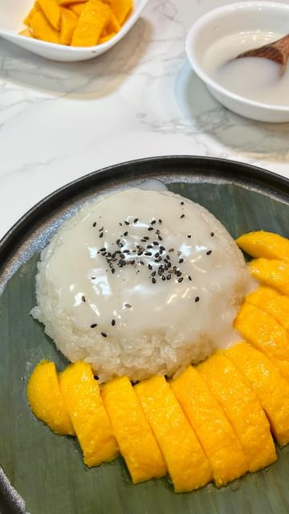

# Mango sticky rice is a delicious tropical dessert originating from the streets of Thailand.  

> recipe by [@iankewks](https://www.instagram.com/iankewks/) 
(Ian | Filipino & Asian recipes) - [see original post](https://instagram.com/p/CgUPzIsDOKM)

\
This is the FOURTH recipe of our five-part mango series, and I’m super excited to share this one with you all! 🥭 \
\
The tart and floral taste of the mango complements perfectly with the sweetness of the coconut sauce, making this dessert absolutely irresistible!\
\
I know I say everything is my favorite, but mango sticky rice holds a special place since many desserts and snacks made from rice are super common in SE asian cuisine that I grew up on.

The recipe + different sticky rice cooking methods is up on the blog now :)\
\
https://iankewks.com/mango-sticky-rice/\
.\
.\
.\
\#mango \#stickyrice \#coconut \#mangostickyrice \#mangodessert 