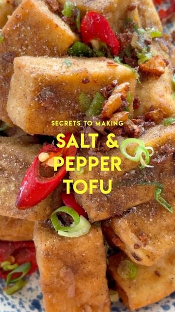

# KILLER SALT AND PEPPER TOFU! 🔪 CRISPY on the outside, MELTY on the inside - make sure you whip this up ASAP ROCKY.  

> recipe by [@itslizmiu](https://www.instagram.com/itslizmiu/) 
(Liz Miu 苗可玉 🍐) - [see original post](https://instagram.com/p/CoLqPC6Azi3)

  
INGREDIENTS  
600g classic or lightly firm tofu (should be kinda wobbly, less dense but not soft tofu)  
Vegetable oil, for frying   
  
FLOUR COATING  
3 tbsp all purpose flour (use rice flour for EXTRA crisp or gluten-free)  
4 tbsp cornstarch (or potato starch)  
1/2 tsp table salt  
1/2 tsp white pepper  
1/4 tsp MSG   
1/8 tsp ground sichuan pepper  
1/8 tsp Chinese five spice   
  
AROMATICS  
1 shallot, roughly chopped  
1 spring onion, chopped  
1 long red chilli, sliced  
4 garlic cloves, rough mince   
  
SECRET SALT MIX  
1/2 tsp table salt  
1/2 tsp white pepper  
1/4 tsp MSG  
1/8 tsp ground sichuan pepper  
1/8 tsp five spice   
  
Full recipe on whisk: link in bio (my website is a mess 😭) so follow me on whisssssk baby!   
  
https://whi.sk/E0uTr   
  
\#saltandpeppertofu \#tofurecipes \#easyrecipes \#chinesecooking   