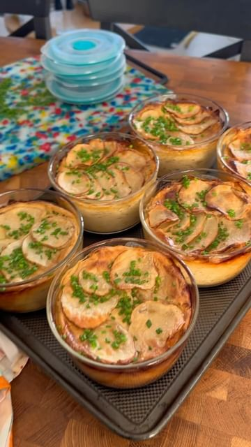

# CREAMY LEEK & POTATO BAKE MEAL PREP 🥔  

> recipe by [@itslizmiu](https://www.instagram.com/itslizmiu/) 
(Liz Miu 苗可玉 🍐) - [see original post](https://instagram.com/p/C72idEGy9eg)

  
(AD/GIVEAWAY!) The cold is upon us here in Sydney and we’re officially turning to cozy winter bakes for food prep! Eeeeeee - I ADORE these single serve glass containers by the fab folks at @decoraustralia and honoured to be working with this iconic aussie brand! These are the 500ml round containers from the Vent & Seal range. Fill, bake, cool, vent, seal (yep- they’re leakproof) then take to work and then just pop-em in the microwave when you want to eat.  No more transferring containers and ruining the perfect bake! 😌 All Décor food storage containers are currently on sale at @bigwaustralia and I’m running a giveaway from my stories and broadcast channel so make sure you check it out!  
  
6 serves   
  
RECIPE  
1.5-2kg potatoes, washed, dried and sliced thin (about 2-3mm)  
Chives, to serve  
  
CREAM SAUCE  
1.5 cup roasted cashews, soaked for 1 hr in hot water and drained  
2 cups water  
2 cups plant-based milk   
1/3 cup nutritional yeast   
1 tbsp + 1.5 tsp vegetable stock powder   
Juice from 1 lemon  
1 tbsp apple cider vinegar   
1 tbsp dijon mustard   
1/2 tsp black pepper  
1 tsp onion powder  
1/2 tsp garlic powder  
  
HERBY LEEKS  
2 tbsp olive oil or butter  
1 leek, sliced thinly on the diagonal  
4 garlic cloves, minced  
Few sprigs of thyme, finely chopped  
1 sprig rosemary finely chopped  
  
Full method in comments!  
  
\#mealprep @decoraustralia   