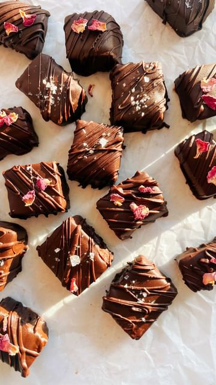

# (AD) Making some THERAPEUTIC CHOC-COVERED DATE CARAMELS to help me get my daily dose of medicinal mushrooms aaand B12! ✨ They’re so satisfying to make and I’ve thrown in my faaaave medicinal mushroom blend from the fabulous Aussie and female-owned @take_bioactives!! These choccies are so easy, yet… so LUXE?! Also I’m going to yelll about this MUSHROOM BLEND FOR A SEC. I’m honestly wild for it because it’s got the whole team, the whole quadfecta: reishi, chaga, cordyceps and lions mane. 😌 We’re talking energy support, less stress, immune support, brain health and a whole lot more but ON TOP OF THAT - ALL 8 B-vitamins jam-packed into it (biologically-availalble so you actually absorb that shhh), including old mate B12 which if you follow a plant based diet, you’ll know is super duper important to staying groovy 🕺🏻 Eat choccy and get the most out of your day! 

> recipe by [@itslizmiu](https://www.instagram.com/itslizmiu/) 
(Liz Miu 苗可玉 🍜 Fun Planty Recipes) - [see original post](https://instagram.com/p/CcEKpIgBuGy)

CHOCCY DATE CARAMELS with TAKe
16 medjool dates, pitted
1/4 cup nut butter 
1-2 tbsp coconut oil
2 tbsp @take_bioactives Mushroom Blend
1/4 tsp Sea Salt
1/2 tsp Vanilla
100g Dark chocolate
Extra flakey sea salt, for sprinkling 

Place all ingredients into a food-processor and process until you get a big sticky ball. Press into a lines loaf tin and refrigerate for 30-45 minutes. Cut into little squares. Melt your chocolate and dip squares to coat and sprinkle with extra sea salt. Refrigerate for a few hours before

👉🏼 AD \#Recipe \#MedicinalMushrooms 