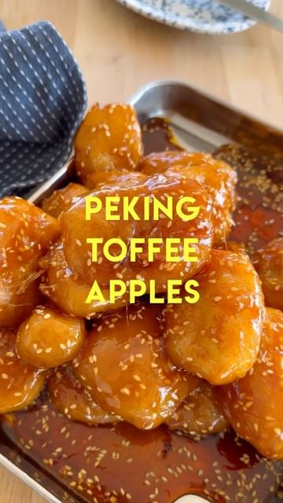

# PEKING TOFFEE APPLES 🍎 These Chinese-style Toffee Apple Fritters are served in caramel SO HOT that you need to plunge them into ICY WATER to set the toffee before eating! 🥶 There’s nothing quite like it. Uniquely crispy, crunchy and sweet. ⚠️ Take care when making this recipe as working with hot sugar is extremely dangerous!! ⚠️ 

> recipe by [@itslizmiu](https://www.instagram.com/itslizmiu/) 
(Liz Miu 苗可玉 🍐) - [see original post](https://instagram.com/p/ColVyrpAhG4)

  
INGREDIENTS  
4 Granny Smith apples (or 5 if small)  
Oil, for deep frying  
Ice,  
Lemon, juiced  
TOFFEE  
400g sugar  
1/ cup rice malt syrup  
1 1/2 tbsp toasted sesame seeds  
DREDGE  
1/3 cup AP flour  
BATTER  
70g all purpose flour  
70g rice flour  
40g cornstarch  
1/2 tsp salt  
2 tsp baking powder  
1/4 cup awuafaba  
3/4 cup icy cold water   
  
 ⚠️ DO NOT TOUCH HOT SUGAR ⚠️   
  
You can find the full recipe on my @whiskapp profile! Link in bio! 😎  
  
\#toffeeapples \#candyapples \#applefritters \#uniquerecipes \#chinesecooking \#recipes \#cooking \#recipeoftheday   