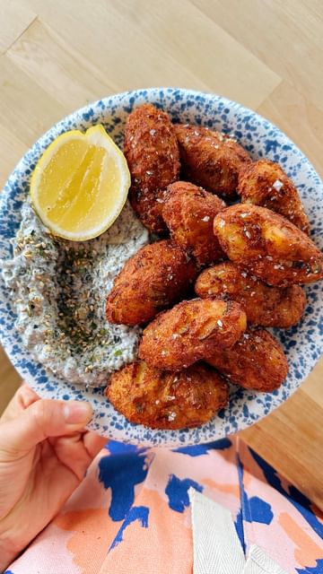

# Portuguese Saltcod Fritters 🇵🇹🐟Bolinhos/Pasteis de Bacalhau (plant-based) 

> recipe by [@itslizmiu](https://www.instagram.com/itslizmiu/) 
(Liz Miu 苗可玉 🍐) - [see original post](https://instagram.com/p/CtbIOk3Jtxv)

  
VEGAN SALTCOD ‘BACALHAU’  
250g tofu shredded   
6 small pieces of dried kombu  
3 tsp salt   
2 tsp mushroom seasoning  
2 tbsp Soy sauce  
  
FRITTERS MIX  
600g potatoes   
1 small onion  
2 tbsp parsley   
  
VEGAN EGG  
2 tbsp flour   
1/3 soy milk  
1 tsp mustard   
  
NORI PICKLE MAYO  
2 sheets korean toasted nori   
1/2 cup veganmayo  
1-2 tsp lime juice  
1 pickle  
  
Lemon wedges, to serve  
  
Full recipe on my Whisk profile!  
  
\#portuguesefood \#pasteisdebacalhau \#bolinhosdebacalhau \#plantbased   