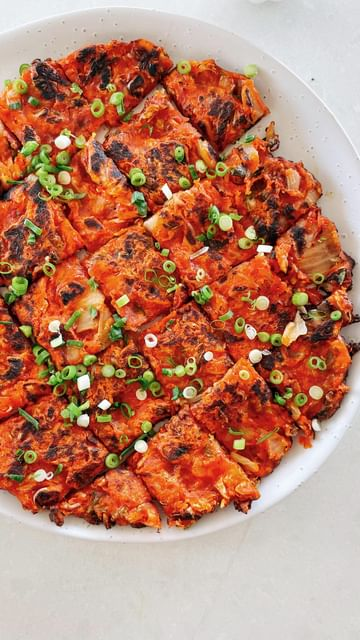

# 2 INGREDIENT KIMCHI PANCAKES 🔥 Crispy, moreish, savoury, a little tangy from the kimchi and SO mouthwateringly DELICIOUS - you can kinda hear my mouthwatering at the end while I’m eating and talking haha. So exceptionally yum with the dipping sauce.  2-ingredients is technically all you need, Kimchi and flour… and a splash of water perhaps! 

> recipe by [@itslizmiu](https://www.instagram.com/itslizmiu/) 
(Liz Miu 苗可玉 🍐) - [see original post](https://instagram.com/p/CjrVX3JpXKy)

-  
INGREDIENTS  
Pancake  
1 cup kimchi  
1/2 cup flour   
1/4 cup kimchi juice (the liquid the kimchi is sitting in)  
1-2tbsp of water, as needed  
Oil for frying  
  
Dipping Sauce  
1 tbsp soy sauce  
2 tbsp rice vinegar  
1/2 tbsp sesame oil  
1/2-1tbsp syrup  
1 stalk spring onion  
2 tsp toasted sesame   
  
METHOD  
Place kimchi into a bowl and use scissors to chop roughly into smaller pieces. Mix flour and kimchi juice in until you get a thick batter - it shouldn’t be runny but also shouldn’t be a paste. Add water if needed. Before frying, mix your dipping sauce by combining all the ingredients in a small bowl. To fry, heat  a goooood splash of oil into your frypan. Add your pancake batter and fry on one side over medium heat until the edges start to crisp up. Flip and cook for just 1-2 minutes. Drain on some paper towel before cutting and serving!  
.  
.  
.  
.  
.  
.  
.  
.  
\#vegan \#veganrecipes \#veganrecipe \#veganfood \#veganfoodie \#veganaf \#vegano \#food52 \#vegansofig \#plantbased \#eatmoreplants \#wfpb \#imhungry \#foodporn \#kimchi \#vegankimchi \#veganasiancooking \#asiancooking \#koreanfood \#kimchijeon \#kimchipancake \#vegankimchipancake \#savourypancake \#easyrecipes \#easyveganrecipes   