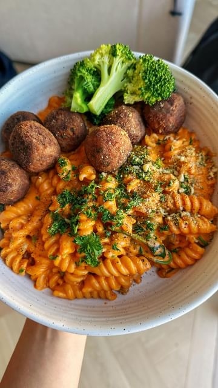

# 5-MINUTE CASHEW ROMESCO SAUCE 🫑  

> recipe by [@itslizmiu](https://www.instagram.com/itslizmiu/) 
(Liz Miu 苗可玉 🍐) - [see original post](https://instagram.com/p/C50Ql1wp5gT)

  
Another great sauce to have prepped and sitting in your fridge for the week. Lasts a full 7-days! So much flavour for such little effort. A little smokey, nutty, tangy and garlicky with a creamy and thick texture. Traditionally it’s a little grainy as it has ground almonds through the sauce but I prefer to blitz mine til smooth and creamy. Use through pasta (adding pasta water as needed) on toast, as a dip - choose your own adventure!  
  
220g roasted red peppers/capsicum (from a jar)  
120g sun-dried tomatoes  
1 garlic cloves  
1 tbsp sherry vinegar  
1 tsp smoked paprika  
100g cashews   
1/2 tsp salt, or to taste   
3 tbsp olive oil   
  
\#romesco   