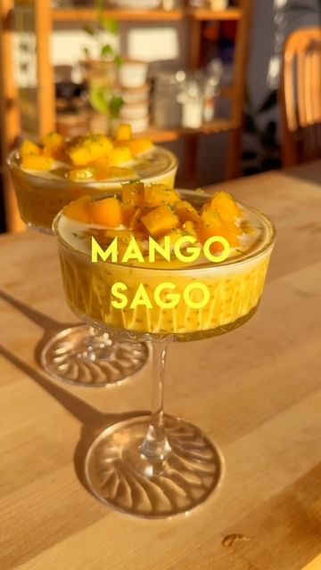

# MANGO SAGO 🥭 the perfect summer dessert! It’s refreshing, cold and not too sweet and really easy to make with only 5 ingredients. If you’re feeling extra, chill your serving bowls/cups 😎 Make sure to use a quality coconut milk, something like @chefschoicefoods - the ingredients are literally just coconut and water and the flavour is too good 🤌🏼 @naturescharm dairy-free sweetened condensed milks are GAME-CHANGING and they have coconut and oat. Highly recommend!  

> recipe by [@itslizmiu](https://www.instagram.com/itslizmiu/) 
(Liz Miu 苗可玉 🍜 Fun Planty Recipes) - [see original post](https://instagram.com/p/CovoAH_AKK_)

  
INGREDIENTS  
3/4 cup tapioca sago   
3 ripe juicy sweet mangoes  
1 cup @chefschoicefoods coconut milk   
1/4 cup @naturescharm sweetened condensed milk (coconut or oat)  
Pinch of salt   
Lime, optional   
  
Full written recipe on Whisk!   