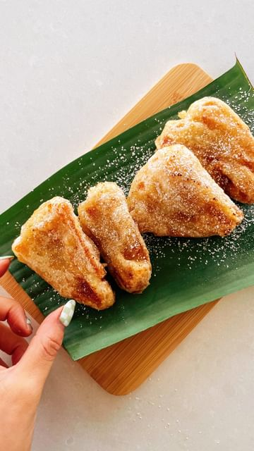

# GRAB YOUR BESTIE! WE’RE EXPLORING VEGAN FOOD IN BALI! 🇮🇩🌴 Together with @thegetawayco, @zaccharybird and @itslizmiu are hosting a magical, fully vegan experience for you in beautiful Bali!!! THE TEMPEH NATION CELEBRATION is on from November 5-15th, 2022 and we’ve got couple and double rooms left!!!! OH and hit up the full recipe for this Pisang Goreng on itslizmiu.com 🍌 

> recipe by [@itslizmiu](https://www.instagram.com/itslizmiu/) 
(Liz Miu 苗可玉 🍜 Fun Planty Recipes) - [see original post](https://instagram.com/p/CgRncftplUN)

\
It’s gonna be one RIPPER of a trip! Packages include: \
\
🌴 10 nights accommodation at a luxury Balinese resort in Canggu (Theanna Eco Villa and Spa)\
🌴 2 delicious plant-based meals per day (breakfast + either lunch or dinner)\
🌴2 culinary experiences: one with Zac Bird and one with Liz\
🌴4 special excursions (Ubud Day, Culture Day, Volcano Hike, Beach Day)\
🌴Opening and closing parties (alcohol is included with these meals) \
🌴A fully 10 day itinerary in Bali organised for you\
🌴1 massage per person at Theanna Eco Spa\
🌴Airport transfers (From Ngurah Rai Airport on arrival and departure days only)\
🌴1 unforgettable experience \
🌴1 group of amazing new friends\
\
Sit back, relax and let us plan your whole Bali vacation for you - HEAD TO THE LINK IN OUR BIO for more booking details or visit thegetawayco.com. \
\
As always, feel free to DM with any questions you have about the trip. 