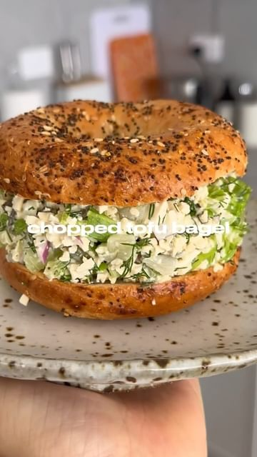

# I know it’s only April but this year has been the best year of my life so far. I think I’m actually the happiest I’ve ever been and it’s got a lot to do of with prioritising wellness. I never really thought I’d be talking about wellness so enthusiastically on here but since turning 30, it’s truly hit me that my health truly is my greatest asset. It can be super difficult to know where to start (and for me, I find re-starting can be even harder) but @28bySamWood is here and may be the just the thing you need to help you start living happier and healthier. It’s packed with guided workouts (and they range in intensity, so you can pick what feels right - which I love as I’m very much a train-to-how-i-feel kind of person) as well as plenty of recipes. If you need a stronger push you can even opt to start the 8-week challenge - long enough to see results but short enough to see it through. Use my code LIZ28 when you sign up for 50% off. @28bysamwood #28bysamwood #ad 

> recipe by [@itslizmiu](https://www.instagram.com/itslizmiu/) 
(Liz Miu 苗可玉 🍐) - [see original post](https://instagram.com/p/C6D0k6jJsUk)

 