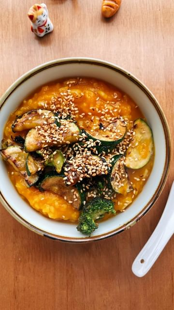

# Pumpkin porridge 🎃 this was brekky with whatever was in the fridge. This year is going SO FAST 😮‍💨 Heading to Bali (for our epic vegan foodie trip!) in one week but have so much to do before then. Honestly I burnt out last week (but was in denial that I needed a break til like Wednesday and was wondering and frustrated and angry at myself as to why I couldn’t get anything done even though I had a million things to do), so I took Thursday to recoup my sh*t and make a plan moving forward. Still not in the best headspace but got some good rest over the weekend and feeling more ready to take on the week. Hope you are well and taking time for your mental health 🫶🏼 Drink water and eat good food! Happy Monday from a rainy Sydney ☔️ #monday #mentalhealth #plantbasedrecipes #pumpkinporridge 

> recipe by [@itslizmiu](https://www.instagram.com/itslizmiu/) 
(Liz Miu 苗可玉 🍜 Fun Planty Recipes) - [see original post](https://instagram.com/p/CkFJS4vJund)

 