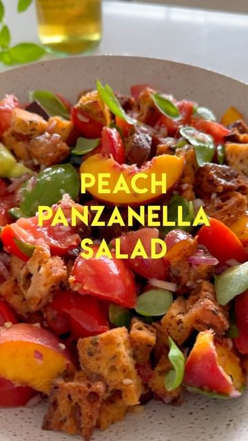

# PEACHY PANZANELLA SALAD 🍅🥖 COZ BREAD SALAD IS THE BEST KINDA SALAD! I’ve been working on this peach panzanella for a while and it’s finally ready! This is my twist on the traditional Tuscan tomato and bread salad and I think that the sweet yellow peaches just go so nicely with the light vinaigrette and also add to the salad visually. 

> recipe by [@itslizmiu](https://www.instagram.com/itslizmiu/) 
(Liz Miu 苗可玉 🍜 Fun Planty Recipes) - [see original post](https://instagram.com/p/CoEdzSSpH8C)

  
SALAD  
300g sourdough, cubed  
2 tbsp olive oil  
6 really ripe juicy tomatoes**  
1 tsp salt  
1 cucumber, optional  
2 very ripe yellow peaches**  
1 cup basil  
  
DRESSING  
2 tbsp white wine vinegar  
1 tsp dijon mustard  
1/2 cup olive oil  
2 cloves garlic  
1/4 red onion or 1 small shallot  
Salt and pepper to taste  
  
**RIPENING TIP: I like to ripen my tomatoes and peaches at room temperature for a few days after buying for extra juicy tomatoes and extra sweet peaches and I pop them into the fridge the night before making this salad.   
  
METHOD  
Preheat oven to 180ºC. Drizzle sourdough with olive oil and a small sprinkle of salt and bake for 15-20 minutes til bread is toasted. Roughly chop tomatoes, place a colander in a bowl and then tomatoes into the colander. Sprinkle over 1 tsp salt and toss for a minute to sweat the tomatoes then leave for 5 minutes so the juices fall into the bowl. Meanwhile roughly chop your cucumber, slice your peaches and mince the garlic and shallot. Whisk white wine vinegar, dijon, salt and pepper, olive oil into the tomato juices. As with most my salads, I like to pour half the dressing out and serve it on the side just incase people don’t like too much dressing (you can’t undress a salad, but it’s easy to add more!). This is also a salad where you want to toss it about 5-10 minutes before serving as the bread will slowly go soggy overtime (the changing texture is beauty of this salad) but I think the sweet spot is after 5-10 minutes of soaking. Toss in the tomatoes, cucumber, peaches, basil and toasted bread with the dressing and serve immediately!   
  
\#panzanellasalad \#recipes \#easyrecipes \#summersalad \#interestingsalads \#goodsalads \#peachseason \#summer   