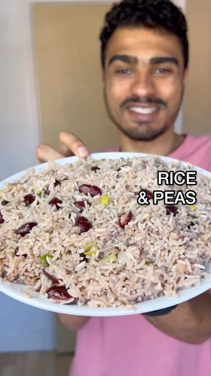

# RICE + PEAS 🇯🇲 a Jamaican classic with plenty of flavour + fiyahh 🔥  

> recipe by [@jacobking](https://www.instagram.com/jacobking/) 
(Jacob King) - [see original post](https://instagram.com/p/CcqMGLYq-Vn)

  
👉🏾INGREDIENTS👈🏾 
-1/4 cup water  
-1 cup coconut milk  
-1 can red kidney beans (juice included)  
-2-3 tbsp coconut oil  
-1 tsp allspice  
-1 large white onion  
-3 spring onion  
-3 garlic cloves  
-1 scotch bonnet  
-few sprigs of fresh thyme  
-pinch of salt + pepper  
-1 cup washed basmati rice  
  
👉🏾METHOD👈🏾 
-fry the garlic + white onion in the coconut oil for 5 minutes on a low heat then add the allspice + fry for another 5 minutes.  
-add the scotch bonnet, thyme, kidney beans, coconut milk + water then bring to a quick boil before adding the washed rice, salt + pepper.  
-turn onto a low heat (lowest possible, if using electric then use another hob so it’s not too hot) add the washed rice then cover + steam for 25 minutes.  
-remove from the heat then fluff with a fork, cover + steam for another 5 minutes before serving with your favourite Caribbean meal!   