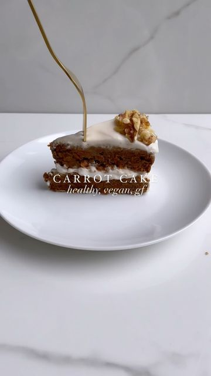

# The tastiest carrot cake recipe!🥕 

> recipe by [@justemslife](https://www.instagram.com/justemslife/) 
(Emma 🇬🇧) - [see original post](https://instagram.com/p/CZJ2vUWoQZ0)

  
This recipe is dairy free, egg free, gluten free & refined sugar free! It would make the perfect snack or even breakfast☺️  
  
Recipe (for a 2 tiered cake):  
🥕2 cup packed grated carrot  
🍏1 cup apple sauce  
🥥1/2 cup melted coconut oil   
🧡4 tsp vanilla essence  
💛4 tsp apple cider vinegar  
🌾3 cup oat flour  
🥥1 cup coconut sugar  
🧂1 1/2 tsp salt  
🥄1 tsp baking soda  
🤎3 tsp cinnamon  
  
•Preheat oven to 180c/350f  
•Mix the first 5 ingredients and leave to sit for at least 10 minutes, then add the rest of the ingredients, mix, and add half of the mixture to two lined baking trays!  
•bake for 30 mins  
•let cool completely before adding any frosting/topping  
  
Coconut frosting recipe:  
🥥1 can coconut cream (only the solid part)  
🍯1/4 cup maple syrup (or icing sugar for a more solid icing)  
🧡1tsp vanilla essence  
🤍1-2tbsp cornstarch to thicken  
  
Mix all ingredients well and then chill in fridge/freezer (not for too long if freezer option)  
  
BAKING FOR 1 PERSON?   
Halve this recipe (only cook one tier), cut the cake in half after cool and stack to create a smaller portion of the two tiered cake!  
  
Hope you enjoy 😌  
  
\#carrotcake \#carrotcakerecipe \#cakerecipe \#cakerecipes \#vegancarrotcake \#vegancarrotcakerecipe \#vegancake \#vegancakes \#vegancakerecipe \#vegancakeshare \#vegandessert \#veganfood \#veganfoodporn \#veganfood \#veganuk \#veganuary \#glutenfreerecipes \#glutenfreecake \#glutenfreecarrotcake   