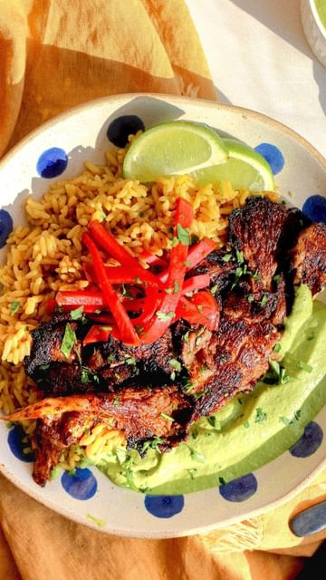

# PUT THIS ON EVERYTHING 🫦 (recipe below) 

> recipe by [@lahbco](https://www.instagram.com/lahbco/) 
(Nasim Lahbichi) - [see original post](https://instagram.com/p/CdGTWBclOVk)

\
This pollo a la brasa inspired marinade takes queues from the classic Peruvian dish. 🇵🇪 Full of citrus notes from lime, warming spices like cayenne and cumin, and the perfect amount of saltiness from soy sauce.\
\
This dish, and marinade, is the perfect example of how beautifully cultures can merge, bringing with it new and innovative meals, traditions, and community. The Chinese/Japanese influence is seen throughout Peru, from Arroz Chaufa (a peruvian fried rice)🍛, to ceviche and its preparation techniques 🐟, to this marinade with its use of soy sauce.\
\
✨Here’s how to make it ✨\
- Juice of 2 limes\
- zest of 1 lime\
- 2 tbsp olive oil\
- 1 tbsp miso paste\
- 1 tbsp dark soy sauce\
- 1 tbsp Dijon mustard\
- 1 tbsp maple syrup\
- 1 garlic clove, minced\
- 1/2 tsp cayenne\
- 1 tsp ground cumin\
- salt, to taste\
\
Directions:\
1. In a food processor, blender, or by hand, combine all of the ingredients above. Adjust salt to taste\
2. Peel apart your oyster mushrooms into chicken nugget bite pieces. Marinate them in a bowl for about 5 to 10 minutes.\
3. Heat 2 tbsp high smoke point oil (like avocado oil) in a cast iron skillet over medium heat\
4. Sear the oyster mushrooms on both sides until golden brown and slightly crispy on both sides\
5. Serve with rice, aji verde, and fresh cilantro\
6. Dive in!\
•\
•\
•\
•\
\#latinamericanfood \#peruvianfood \#peru \#polloalabrasa \#oystermushrooms \#mushrooms \#plantbased \#plantbasedalternatives \#veganrecipes \#quicklunch \#dinnerideas \#dinnerrecipes \#plantbasedrecipes \#latinfood \#f52gram 