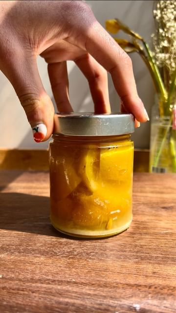

# PRESERVED LEMONS 🍋 are in 🫦 (recipe below) 

> recipe by [@lahbco](https://www.instagram.com/lahbco/) 
(Nasim Lahbichi) - [see original post](https://instagram.com/p/CdOC9AdFYY_)

  
🇲🇦But throughout the maghreb community and the Middle Wast/North Africa- they’ve always been in! Preserved Lemons are used throughout a variety of communities and cultures. 🌍  
  
In Morocco, preserved lemon is used for a variety of dishes, but famously for their preserved lemon & olive chicken tagine. My fondest memory of using these tangy citrus and their sappy juices are of my grandmother finely mincing every bit to add to her tagine for dinner. The result you ask? The perfect amount of tang, acidity, brightness, and ✨funk✨ with every bite 🫦  
  
Here’s how you make it:  
*4 to 6 lemons (depending on size of mason jar)  
*about 1/2 cup coarse kosher salt  
*juice from 2 lemons  
Directions:  
1. Rinse your lemons well and grab a sterilized mason jar.   
2. Slice the lemons in half in one direction and then in half again in the other, creating four segments but relieving them intact on one side.  
3. Add about 2 tbsp of salt to the bottom of the jar. Pour salt into the al enter of the lemon, separating the quarters of the lemons to ensure salt gets into every nook and cranny  
3. Add the lemon to the jar, cover with more salt, and repeat the process. Slightly squeeze the lemons in the jar after every drop.  
4. Cover with a tight lid and leave in a cool, dark place for 4 to 6 weeks. DO NOT OPEN THE JAR! I PROMISE YOU ITS WORKING  
5. After 4 to 6 weeks, you should be left with fermented, sappy, softened lemons and their juices to use in salad dressings, pasta, tagines, or even dessert  
  
🫶🏻  
  
\#preservedlemon \#lemon \#morocco \#moroccanfood \#northafricanfood \#lemonrecipes \#easyrecipes \#plantbased \#pickling \#foodblog \#easyfoodrecipes   