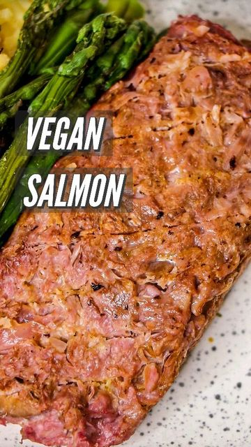

# 🍣🌿 VEGAN SALMON 🌿🍣  

> recipe by [@lissa.elle](https://www.instagram.com/lissa.elle/) 
(Melissa | Vegan Food & Lifestyle) - [see original post](https://instagram.com/p/CaFtPehK2_i)

  
CC: You've seen my vegan cod, now it's time for vegan salmon! The recipe below in the caption will make 1 and a bit large or 2 small fillets of salmon. You can make it (which only takes 30mins or less), freeze them and use when necessary. Look at that texture! You can have it in a multitude of meals; I had mine with lemon and garlic creamy spaghetti, check my last reel for the recipe.  
  
You definitely won't regret making this!  
  
*PR-AD @jacknchillfoods - the BEST jackfruit out there. Perfect for this recipe.  
Soy free/gluten free/dairy free/fish free.  
  
INGREDIENTS  
2 tbsp wakame/1 sheet of nori  
300ml cold water  
170g @jacknchillfoods*  
⅛ tsp beetroot powder   
2 tbsp caper brine  
2¼ methylcellulose  
¼ tsp salt   
  
METHOD  
Put the water and wakame into a pan and bring to a boil on medium heat with no lid.   
  
When it starts to boil, reduce heat to a simmer for 2 minutes before draining the wakame from the water (save the wakame to add to a yummy meal!)   
  
Add in the jackfruit and simmer for a further 5mins. Drain the jackfruit in a sieve and quickly add to a bowl (whilst lukewarm and add in the the rest of the ingredients, mixing until it starts to stiffen up. Divide and mould mixture into fillets, wrap in baking paper and put it in the freezer for at least 2-3hrs. If cooking from frozen, defrost until there is a slight "bounce" when cooking. Cook via frying on both sides on medium heat, 4-5mins each side or until slightly golden. Serve as you wish.   