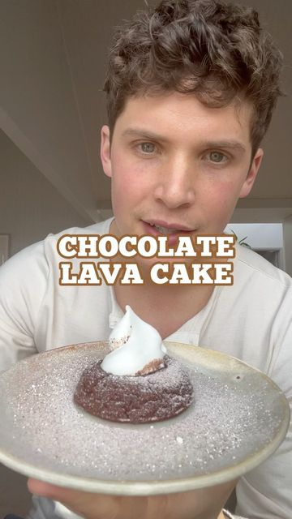

# The perfect dessert for a stay at home date night  

> recipe by [@maxlamanna](https://www.instagram.com/maxlamanna/) 
(Max La Manna) - [see original post](https://instagram.com/p/CZ2GYQ0t6_O)

  
👆🏼Tag and share this Chocolate Lava Cake   
  
Incredibly easy to make  
Chocolatey   
Moist  
Rich  
Decadent  
  
60g dark chocolate  
2 tbsp coconut full fat cream solid  
70g flour (GF optional)  
25g cocoa powder  
50g sugar granulated  
100g oat milk   
2 tsp apple cider vinegar  
1/2 tsp baking powder  
Pinch of salt  
2 tbsp plant-based butter  
1 tsp vanilla extract  
50g whippable cream  
  
Melt the chocolate and coconut cream together, stir to combine.   
Once melted, freeze for 30 minutes.  
  
Cake batter:  
Preheat oven 190C/375F  
Grease a muffin tray  
Make buttermilk by combining oat milk and apple cider vinegar, set aside for 5 minutes.  
Sift the flour and cocoa powder into a large bowl.   
Add salt, sugar, baking powder, melted butter, buttermilk and vanilla extract.  
Stir to combine - the batter should be thick, but pourable.  
Pour the batter into the bottom of the ramekin or muffin tray, about 1/4 full.  
Add 1 tbsp frozen chocolate ganache to the centre.  
Cover with the remaining batter.  
Bake for 15-17 minutes - edges are firm, but the inside jiggly.  
Remove from oven, cool for 2-3 minutes.  
Add the whippable cream to a bowl, whip until firm.  
Gently wiggle a knife around the edges of the cake.   
Serve cake with a sprinkling of icing sugar and cocoa powder and a dollop of whipped cream.  
  
\#reels \#instagram \#instagramreels \#instagramfood \#valentines \#chocolate \#lavacake \#cook \#eat \#dessert   