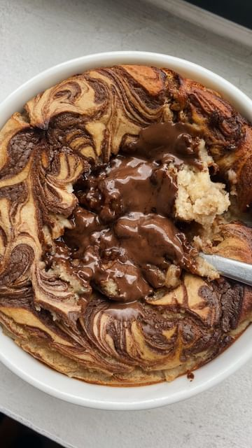

# The classic never fails 🤝 Just a regular choccy spread filled baked oats 😌 

> recipe by [@minimin.eats](https://www.instagram.com/minimin.eats/) 
(🍩 Min 🍩) - [see original post](https://instagram.com/p/CanC0_HKKoh)

  
🥣Recipe🥣  
- Half a mashed banana  
- 40g @myprotein instant oats/oat flour  
- 15g @awesomesupps vanilla vegan protein powder  
- 1/2tsp baking powder  
- @myprotein vanilla flav drops   
- 80ml water/milk of choice   
  
Filling: 1 heaped tsp @myprotein hazelnut chocolate spread   
  
Optional topping: same spread, but melted and drizzled out top   
  
1. Preheat the oven at 180C fan.  
2. In a bowl, mix everything for the oat batter .   
4. Transfer 3/4 of the oat mixture in a separate bowl, place the spread in the middle and top it off with the rest of the oat mixture.   
5. Optional: drizzle the melted spread on top and create some swirls! 😵‍💫  
6. Bake for 20 minutes and ENJOY your god sent breakkie! 🤝  
  
Tag me in your recreations 💫  
  
Use code “MINIMIN” for 37% OFF @myprotein 😊 support me by shopping through the link in bio xx  
.  
.  
.  
.  
.  
.  
.  
.  
.  
.  
.  
.  
.  
.  
.  
\#porridge \#porridgebowl \#porridgelover \#porridgeporn \#porridgeoats \#proteinporridge \#proats \#oats \#fitfoodie \#fitfood \#breakfast \#breakfastbowl \#thefeedfeed \#foodstagram \#oatmeal \#oatmealbowl \#oatmealrecipe \#overnightoats \#healthyfood \#breakfastideas \#foodblogger \#reelsinstagram \#bakedoats \#london \#londonfoodie \#londonfoodblogger \#bakedoats \#reels \#foodporn \#foodphotography @tastemade @thekitchn @eatingwell   