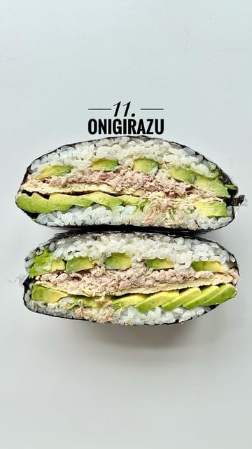

# ONIGIRAZU aka sushi sandwich 😮‍💨  

> recipe by [@myriadrecipes](https://www.instagram.com/myriadrecipes/) 
(👋🏼 Em | Recipes) - [see original post](https://instagram.com/p/CdD5Vn1voS4)

  
This is a simple Japanese sushi sandwich filled with tuna mayo, omelette, and avocado 🥑   
  
Recipe below ✌🏽  
  
𝕀𝕟𝕘𝕣𝕖𝕕𝕚𝕖𝕟𝕥𝕤  
(Makes 1 Onigirazu)  
The Sandwich:  
75g sushi rice  
1 tbsp rice wine vinegar  
1 tsp sugar  
1/2 tsp salt  
2 nori sheets  
1 tin tuna  
1 tbsp mayonnaise  
1 avocado, sliced  
1 egg  
  
Sauce:  
1 tbsp mayonnaise   
1/2 tbsp sriracha  
  
𝕄𝕖𝕥𝕙𝕠𝕕  
1. Cook the rice according to package instructions.  
2. Let the rice cool and then add in your rice wine vinegar, sugar, and salt mixture (make sure the salt and sugar have dissolved). Combine and set aside.  
3. In a small bowl, combine the tuna, 1 tbsp mayonnaise, and some seasoning.  
4. Place a non-stick frying pan on medium heat with a splash of oil. Whisk up your egg and then pour it into the pan. Form into a square (3-4 inches in length/width). Remove and set aside.   
5. Get your nori sheet and place down on a surface with a corner pointing towards you. Add half the rice in a square (side facing you, see vid). Top with avocado, tuna, omelette, more avocado, and the other half of the rice.   
6. Cut out a smaller square from your nori sheet and place on top of the rice. Dab a bit of water on each of the nori corners and then fold up to form a parcel.   
7. Grab some cling film and wrap it up into a tight package.   
8. Place in the fridge for 30 mins and then cut in half and enjoy!  
   
  
\#onigirazu \#japanesecooking \#onigirazusandwich \#japanese \#japanesesandwich \#sushisandwich \#foodiesofinstagram \#sandwichworldtour   