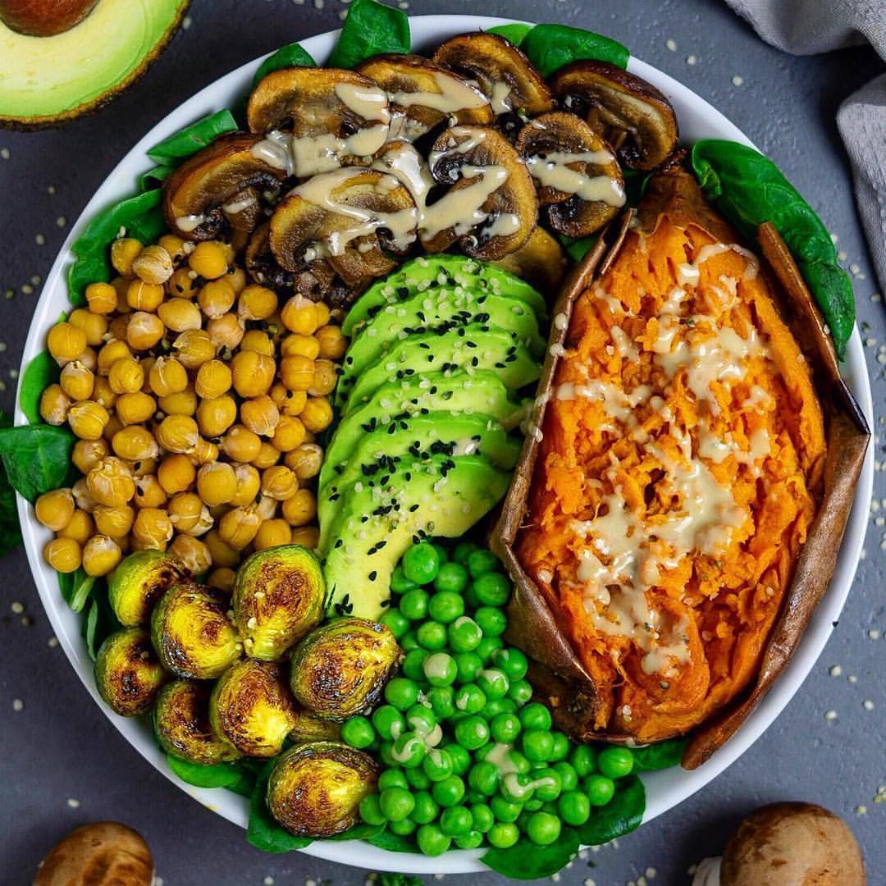

# 🤤Smash or pass? 

> recipe by [@nimai_delgado](https://www.instagram.com/nimai_delgado/) 
(Nimai Delgado | Vegan Fitness Coach) - [see original post](https://instagram.com/p/BrNr5kEhSGI)

-
I’d smash this for breakfast, lunch, and dinner!
-
Creamy baked sweet potato, roasted mushrooms and Brussels sprouts, avocado and peas 😍👏🏻 My absolute favorite foods on one plate 😋. I topped my bowl with hemp seeds, black cumins seeds and of course tahini 💚😁🙏.
.
To get a perfect creamy sweet potato preheat the oven to 240 degrees Celsius (450 degrees Fahrenheit).
Moisten the sweet potato with water, make several cuts all over with a knife and wrap it in aluminum foil. 
Place on the rack in the middle of the oven and bake for about 1 hour. The sweetpotatoe is ready when it feels soft and can be pressed in. 😍🙏😋.
.
I wish you all a great evening 😍💚
-
Repost from @plantbased_food_and_travel
-
Follow my food page @veganbodybuildingfood for more recipes and macros!
•
•
•
•
•
\#plantbasedpower \#avocado \#veganfood \#veggies \#veganrecipes \#foodstagram \#vegan \#plantbased \#realfood \#eeeeeats \#feedfeed \#f52grams \#veganworldshare \#foodie \#plantbasedfood \#chickpeas  \#healthyfoodshare \#recipes \#dinner \#highcarb \#vegangermany \#veganbowls \#whatveganseat \#eatyourgreens \#vegetarian \#eathealthy \#healthyfood \#vegansofig \#vegandinner \#veganbodybuildingfood 