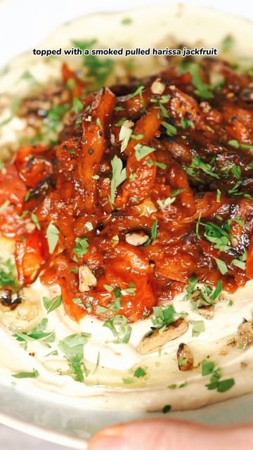

# THE CREAMIEST HUMMUS EVER WITH HARISSA JACKFRUIT 🫘  

> recipe by [@nomeatdisco](https://www.instagram.com/nomeatdisco/) 
(• Sam | No Meat Disco •) - [see original post](https://instagram.com/p/Cg9pcjSKTrC)

\
Hands down this is the creamiest hummus I’ve eaten. Better than any shop bought hummus I’ve had and it’s actually super simple to make with a few secret techniques.\
\
I originally saw this from the hummus king @bensvegankitchen and then saw @bunchuk post one the other day too! \
\
I made this with a delish Smokey Harissa jackfruit. It was so good, I struggle cooking with jackfruit usually but I’ve now found a way where I enjoy the taste and texture more than I used to.\
\
Ingredients\
For the hummus:\
1 Large Jar of good chickpeas\
1 Clove Garlic\
3/4 Cup good quality tahini \
Juice of half a lemon\
1/3 cup chickpea brine\
3/4 ice cubes\
2 Tsp cumin\
2 Tbsp Olive oil\
Salt\
\
For the harissa jackfruit:\
1 Can Jackfruit (I used one in syrup)\
Tomatoes\
1 1/2 Tbsp harissa paste\
1 Clive garlic\
Oil \
Salt\
\
Method: \
1. Start by boiling some salted water, add your chickpeas and garlic into the water, but keep the chickpea brine separate for later. Boil the chickpeas for 20 mins to half an hour.\
2. Whilst they’re boiling, grab the jackfruit out of the can and pull it with two forks to make little strips.\
3. Heat up some oil in a skillet and add in the jackfruit with the chopped garlic. Cook until charred slightly, then add in the harissa page and the tomatoes. Cook down the tomatoes until the burst and char off the jackfruit.\
4. Drain the chickpeas once cooked and add to a blender with the chickpea brine and garlic clove from earlier. Blitz until they form a paste like consistency.\
5. Now add in the tahini and blend, then whilst blending add in the ice cubes one at a time.\
6. Then add in the cumin, olive oil, salt and lemon juice and blitz one last time or until it’s as smooth as like it.\
7. Plate up the hummus, drizzle some olive oil over it, top on the jackfruit and tomatoes and season with fresh parsley and some smoked walnuts and you can blow torch the top of the jackfruit if you like it Smokey! \
\
\#hummus \#hummusrecipe \#hummuslover \#veganisrael \#vegan \#jackfruit \#jackfruitrecipes \#veganuk \#easyvegan \#easyrecipes \#plantbased 