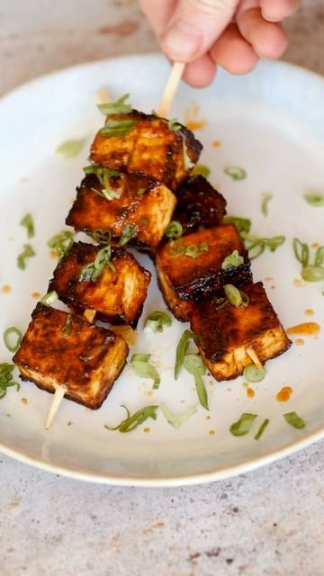

# CAJUN ORANGE TOFU LOLLIPOPS 🍊 🍭 

> recipe by [@nomeatdisco](https://www.instagram.com/nomeatdisco/) 
(Sam Jones | No Meat Disco) - [see original post](https://instagram.com/p/ChC7yqJqIv-)

  
10 minutes that’s all you have left… what are you guna do with it? I reckon you should make these Cajun and orange tofu lollipops! Cause they’re bloody insane 😍  
  
Ingredients  
1 Block firm tofu  
For the marinade:  
1 Orange  
2 Tbsp Maple syrup   
1 Tbsp Cajun spice blend  
1 Tsp garlic powder  
1 Tbsp soy sauce  
  
Spring onions to serve  
Skewers  
  
Method:  
1. Drain your tofu and chop it into cubes. I added mine to the air fryer for 6 minutes just to fry it out slightly.  
2. Mix together the marinade ingredients in a bowl and then add the tofu cubes in there to marinade.  
3. Now you can simply wack them on skewers and add them to a grill or BBQ, or fry them in a pan to char them up to you! Season with spring onions and enjoy!   
  
\#tofu \#tofulover \#tofulovers \#cajunfood \#skewers \#vegangrillen \#veganbbq \#vegan \#veganuk \#plantbased \#plantbasedrecipes \#easyvegan \#easyrecipes   