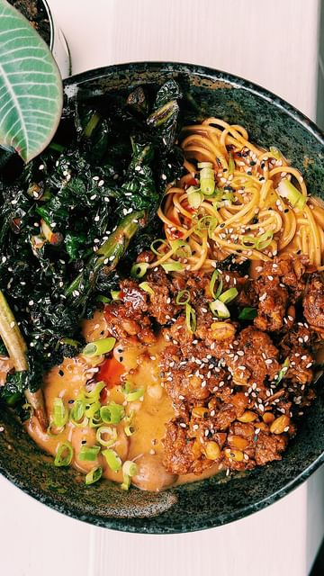

# SPICY PEANUT NOODLE SOUP 🍜 

> recipe by [@nomeatdisco](https://www.instagram.com/nomeatdisco/) 
(Sam Jones | No Meat Disco) - [see original post](https://instagram.com/p/C_s3NSBoXOc)

  
Welcome to episode 1 of One Pot Disco. For all you uni heads this series is perfect for ya! If you don’t want too much to clean up and you’re looking to keep your health going whilst partying. Then follow this series!   
  
Ingredients   
For the greens:  
3 sprigs of cavalanero   
4 sprigs tender stem brocolli  
1 clove garlic  
2 tbsp soy sauce   
Splash of water   
Oil  
For the tempeh:  
Half a block tempeh (I used @tempehmeades )  
2 tbsp sriracha caramel (I used @chimacdublin alternatively you can use normal sriracha and a splash of maple and soy)   
Oil  
For the soup:  
3 spring onions  
3 cloves garlic  
1 handful chestnut mushrooms  
1 thumb piece ginger  
1 tbsp Korean seasoning   
1 can coconut milk then fill up the can again with a stock cube  
1 tbsp gochujang   
1 tsp MSG  
1 Tsp white pepper   
2 tbsp peanut butter   
Juice of half a lime  
Glug of sesame oil  
Ramen Noodles   
Top with sesame seeds and chilli oil  
  
Method:  
1. Start by frying your greens off in some oil, with the garlic, after a few minutes add in the soy sauce with a splash of water and cover with a led to let them steam.  
2. Once your greens are cooked, set them aside in a bowl and crumble up your tempeh and add them to the same pan with the sriracha caramel, drizzle on a bit more oil and cook for 3/4 mins or until caramelized, then set them aside in a bowl.  
3. Add some more oil in a pan and add in the mushrooms and spring onions, season and cook down. Then add in the garlic and ginger and seasoning and cook for a few more minutes.   
4. Go in with the coconut milk and stock, bring to a simmer and add in the gochujang, white pepper, MSG and peanut butter and lower the heat and let it thicken. Then add in the noodles to cook.  
5. Turn off the heat and add in the lime juice and sesame oil, then serve up and top with chilli oil and sesame seeds and enjoy!   
  
\#ramen \#noodlesoup \#vegan \#asianrecipes \#noodles   
\#unimeals   