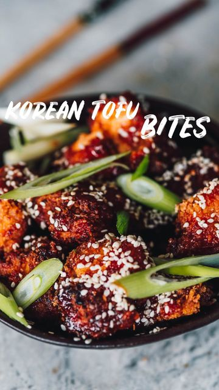

# KOREAN TOFU BITES 🍜  

> recipe by [@nomeatdisco](https://www.instagram.com/nomeatdisco/) 
(• Sam | No Meat Disco •) - [see original post](https://instagram.com/p/CZ94z8UKUJe)

  
Happy \#valentines day you beautiful people!   
  
I feel like everyday should be full of love whether you give it or receive it. So I’m giving you heaps of love with this incredible recipe that you can make for yourself or your partner 😍  
  
Ingredients  
For the tofu marinade:   
1 Block Firm Tofu  
1/2 Cup Plain Flour  
1/4 Cup Plant Based Milk  
1 Tbsp Soy Sauce  
1 Tsp Ginger Powder  
1 Tsp Garlic Powder  
1 Tbsp Gochujang paste  
  
For the sauce:  
2 Tbsp Gochujang paste   
1 Tbsp Agave Syrup  
1 Tbsp Soy Sauce  
1 Tsp Garlic Powder  
1 Tsp Lemon Juice  
1 Tsp Sesame Oil  
  
For garnish:  
Sesame seeds  
Spring onions   
Vegetable Oil  
  
Method:  
1. Start by pressing the liquid out of your tofu and break it up into large chunks.  
2. Now coat it in all the marinade ingredients and mix well.  
3. Coat it in the flour and mix and then the milk and mix.  
4. Now drop each one into the Panko breadcrumbs and coat.  
5. Heat up some vegetable oil until hot and carefully drop in the tofu chunks. Cook for 3 mins each side.  
6. Now make the Korean sauce by mixing together all the ingredients and then drizzle it over the fried tofu chunks. Season to taste and add the sesame seeds and spring onions and ENJOY!!!  
  
\#koreanfood \#koreanvegan  \#popcornchicken \#veganmeat \#vegan \#veganfood \#cheapvegan \#veganaf  \#easyveganrecipes\#veganrecipes \#vegansofinstagram \#veganmeals \#veganrecipe \#vegetarian \#veganeats \#veganlife \#easyvegan \#veganfoodie \#vegansofig \#veganfoodlover \#veganfoodshare \#veganeats \#plantbased \#plantbasedfood \#veganuk \#veganinstaclub \#plantbaseddiet \#healthyvegan  \#healthyveganrecipes   