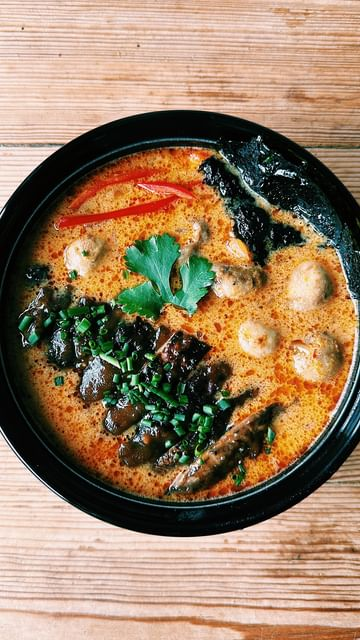

# TOM KHA GAI - THAI COCONUT SOUP 🥣  

> recipe by [@nomeatdisco](https://www.instagram.com/nomeatdisco/) 
(Sam Jones | No Meat Disco) - [see original post](https://instagram.com/p/C4nqeTvq8u_)

  
Who’s over these rainy days?   
  
These rainy grey days are dragging out a bit too much now! We need some sun!!! But I’ve saved you and bought a bit of colour to our lives with this Thai coconut soup!   
  
Ingredients  
1 large Portabello mushroom  
1 tbsp peanut butter (I used @containsnutsltd reaper)  
1 tbsp soy sauce  
1 tbsp maple syrup  
2 tbsp warm water   
1 tsp garlic powder  
Toppings: Chives, Chillies, Nori Sheets, coriander  
  
For the soup base:  
1 onion  
3 cloves garlic  
1 punnet button mushrooms  
1 tsp minced lemongrass  
1 tbsp red Thai curry paste  
1 can coconut milk  
2 tsp palm sugar/brown sugar  
Salt and pepper   
  
Method:  
1. Start by frying off your onions, garlic and mushrooms in some coconut oil. Season well, cook for a few minutes.  
2. Now add in the lemon grass and thai red curry paste and stir to combine. Add in the coconut milk and bring to a boil, then go in with the palm sugar and bring to a simmer.  
3. Now add your Portabello mushroom to a skillet with some oil, season and press until it softens and reduces in size.   
4. Mix together the peanut butter, soy sauce, maple syrup, garlic powder and warm water and then pour it into the pan with the mushroom and let it soak up that sauce and reduce.  
5. Serve up your soup, top with the satay mushroom and all the other toppings and enjoy!   
  
\#soupseason \#thaifood \#vegan \#tomkhagai   