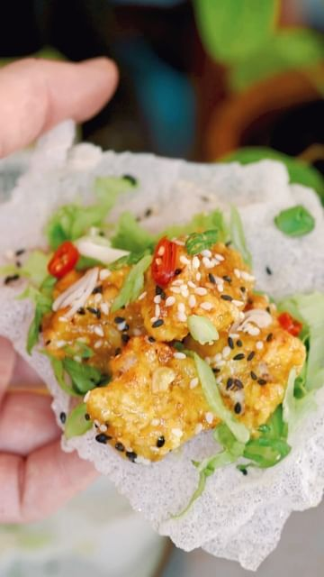

# CRISPY ZINGY VEGAN HONEY GINGER TOFU CUPS 🥬  

> recipe by [@nomeatdisco](https://www.instagram.com/nomeatdisco/) 
(Sam Jones | No Meat Disco) - [see original post](https://instagram.com/p/Chphig5q9nC)

  
So I created this fun, simple and delicious dish for the guys over at @mojudrinks   
  
They have teamed up with @eatenaliveldn to create this incredible ginger (s)hot sauce.   
  
I mean you can never have too much ginger in your life right? 😏  
  
Ingredients  
Block of firm tofu   
Rice paper sheets  
  
For the wet batter:  
1 Cup corn starch  
1/4 cup water  
For the dry batter:   
Panko breadcrumbs  
Salt pepper  
Sesame seeds  
  
For the zingy vegan honey ginger sauce:  
1 Tbsp @moju ginger (s)hot sauce   
2 cloves garlic  
1 Tbsp maple syrup  
1 Tsp soy sauce  
Enough Veg oil for frying (roughly 4 Cups)  
  
Method:  
1. Start by mixing the wet batter ingredients. Chop your tofu into roughly 2cm cubes and add in to the wet batter and then the Panko mix.  
2. Add the battered tofu to the air frier/oven for 10 mins at 200C.   
3. Whilst that’s in the oven, mix together the sauce ingredients in a bowl.  
4. Now grab your rice paper sheets, cut them into quarters and heat up alot of vegetable oil.  
5. Drop your rice paper sheet quarters into the oil and the should form little shriveled cups.  
6. Now heat your zingy sauce ingredients in a pan for 4-5 mins and then grab your tofu out of the air fryer and coat it in the zingy sauce.  
7. Load of the rice paper cups with the tofu and top with some more of that moju (s)hot sauce and season with sesame seeds and coriander.   
\#ad   
\#tofu \#tofulover \#tofurecipes \#ricepaper \#vegan \#ukvegan \#plantbased \#plantbasedrecipes \#easyrecipes \#easyvegan \#asianfood   