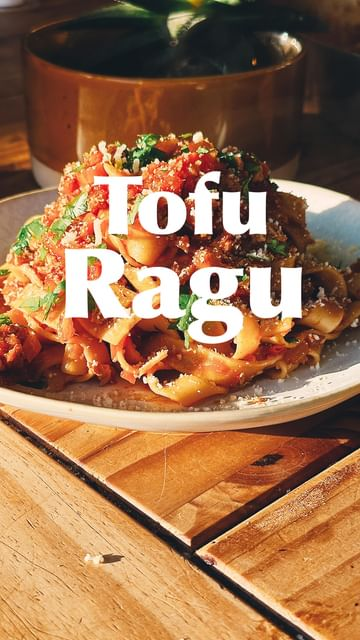

# TOFU RAGU 🍝  

> recipe by [@nomeatdisco](https://www.instagram.com/nomeatdisco/) 
(• Sam | No Meat Disco •) - [see original post](https://instagram.com/p/CpFcIQwKVIk)

  
Welcome back to \#eatsnbeats where I bring you some of favorite sounds paired to a track that I think works!   
  
I’ve always been a huge fan of @loylecarner and his latest album has been on repeat a lot for me over the last few months!   
  
To pair with that this tofu ragu was bloody amazing, packed full of flavour and protein it was insanely good!   
  
Ingredients  
1 block firm tofu   
1 onion  
2 celery stalks  
2 carrots  
Half tsp vegemite/marmite  
1 tsp liquid smoke/smoked paprika  
1 tbsp tomato paste  
150ml veg stock  
1/4 cup red wine  
1 can peeled plum tomatoes  
1 tsp baking powder  
1 tsp brown sugar  
Salt and pepper  
Glug of olive oil  
Your choice pasta (I used linguine)  
1 tbsp pasta water   
Vegan Parmesan to serve  
Parsley to serve  
  
Method:  
1. Start by frying your onion, celery and carrots for 3-4 mins until fragrant and softened.  
2. Now crumble in your tofu with the vegemite, liquid smoke, tomato paste and then stir it in and cook for a few minutes.  
3. Add in the veg stock, red wine and peeled tomatoes bring it to a boil then add the baking powder and sugar, stir than in and then reduce the heat to a simmer to thicken.  
4. Cook your pasta to packet instructions and once cooked, drain it but keep a bit of the pasta water and combine the pasta and sauce together and toss to coat. Serve with Parmesan and parsley and enjoy!!   
  
\#ragu \#tofuragù \#tofu \#tofurecipes \#tofulover \#veganitalianfood \#italianfood \#italiansdoitbetter \#vegan \#veganuk \#plantbased \#plantbasedrecipes \#easyvegan \#easyrecipes   