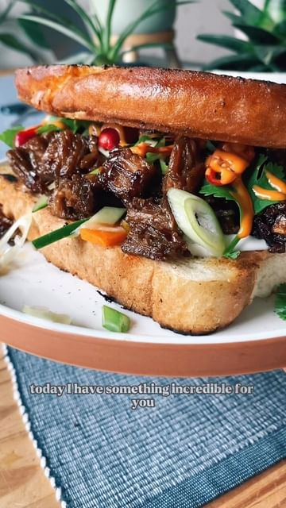

# DECONSTRUCTED BÀNH MI TOASTIE 🥪  

> recipe by [@nomeatdisco](https://www.instagram.com/nomeatdisco/) 
(• Sam | No Meat Disco •) - [see original post](https://instagram.com/p/CljeElUKwlj)

\
Banh mi is one of of my favourite sandwiches to date, in Vietnam I ate them near enough everyday and then the same when in Australia 😂\
\
So I had some vegan steaks from a brand called @chunk_foods and I thought I would create this with the vegan meat and it held together amazingly and tasted so dam good! \
\
Ingredients \
1 Vegan Steak\
2 Tbsp Hoisin Sauce\
1 Tbsp Soy sauce\
1 Tsp Chilli oil\
1 Tbsp Vegan Butter\
\
For the pickled veggies:\
1 Carrot \
1/2 a Cucumber\
1 Tbsp Rice Vinegar \
1 Tsp soy sauce \
1 Tbsp Brown sugar\
1 Tsp Salt\
1/2 Cup warm water\
\
Spring onions\
Vegan mayo\
Sriracha mayo\
Lots of coriander \
2 slices of thick bread\
1 Tbsp Vegan butter\
\
Method:\
1. Start by adding all the pickled veg ingredients into a jar and shaking and letting sit whilst you cook the rest.\
2. Cook your vegan steak for a few minutes each side in some butter and toss in a garlic clove and baste it and season generously with salt and pepper.\
3. Pull your steak apart into shreds and add it back to the pan with the hoisin, soy sauce and Chilli oil and fry until slightly charred.\
4. Add your slices of bread to the skillet with some vegan butter and fry until slightly charred and crisp.\
5. Now build your sandwich… vegan mayo, pickled veggies, the vegan meat then the sriracha mayo and the spring onions and coriander and Chillies and ENJOY!! \
\
\#banhmi \#toastie \#sandwich \#vietnamesefood \#veganvietnamese \#vegan \#veganuk \#easyvegan \#easyrecipes \#plantbased \#plantbasedrecipes 