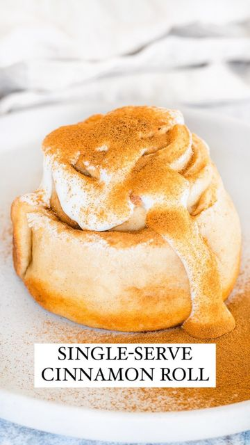

# Single-Serve Cinnamon Roll (high protein, vegan) 😍

> recipe by [@nourishing.niki](https://www.instagram.com/nourishing.niki/) 
(Nikita Messina - Easy & Healthy Recipes) - [see original post](https://instagram.com/p/CaSiCl8qW0F)

  
This is a fun one to make after a workout or just for a lil dessert 😬  
  
INGREDIENTS:  
- 30g plain flour  
- 20g vanilla protein powder   
- 1/2 tsp baking powder   
- 60g thick yoghurt   
- 1 tsp sugar or sweetener   
- 1/2 tsp cinnamon  
  
METHOD:  
1. Combine flour, protein powder & baking powder.  
2. Add in yoghurt and mix until you can’t mix any more, then transfer onto a flat surface (dusted with flour) and knead until it forms a ball (you may have to sprinkle with a bit more flour if it’s too sticky!)  
3. Once you have a ball f dough, roll it between your palms to create a cylindrical shape, then roll it out (around 20cm x 10cm)  
4. Slice it down the middle and press the ends together to form one long strip (40cm x 5cm)  
5. Combine sugar & cinnamon and sprinkle it over the dough.  
6. Roll it up and bake in a greased ramekin for 20mins @ 180°C (160°C fan)  
7. To make frosting combine 1 tbsp yoghurt with 1 tsp icing sugar 🥰   
  
Full recipe with ingredient substitutions, alternative measurements & macros is on my blog (link in bio!) 💃🏽 
.  
.  
.  
  
\#cinnamonroll \#singleserve \#singleserving \#veganuk \#plantbasedbaking \#glutenfreebaking \#plantbasedfoods \#plantbaseddiet \#plantbasedfoodie \#fitfoodie \#fitfood \#highprotein \#proteinrecipes \#healthyfoodhare \#foodreels \#recipereels \#healthyfoodblog \#foodbloguk \#ukfoodblog \#food52 \#thekitchn \#thefeedfeed \#foodfreedom \#foodisfuel \#balancedeating \#recipereels \#foodreels \#highproteinvegan \#eattogrow \#strongnotskinny   