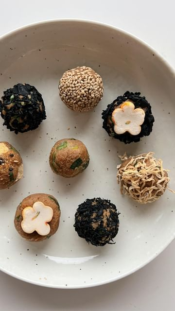

# Miso Balls 味噌玉 (Miso-dama) ⁣ 

> recipe by [@okonomikitchen](https://www.instagram.com/okonomikitchen/) 
(Lisa Kitahara) - [see original post](https://instagram.com/p/Cn2A6B9D9pu)

⁣  
So easy that even my roomie can make!! 😗⁣  
⁣  
Lots of variations you can make for throughout the week, here are some suggestions: ⁣  
⁣  
green onion (fresh or dried)⁣  
dried wakame (seaweed)⁣  
fu (wheat gluten)⁣  
kiriboshi daikon (dried daikon)⁣  
aburaage (fried tofu sheet)⁣  
koya tofu (freeze dried tofu)⁣  
umeboshi (pickled plum)⁣  
freeze dried vegetables⁣  
natto* - must freeze⁣  
⁣  
Full recipe on the blog or google ‘miso balls okonomikitchen’ ⁣  
⁣  
⁣  
\#miso \#misosoup \#misorecipe \#misoballs \#misobombs   