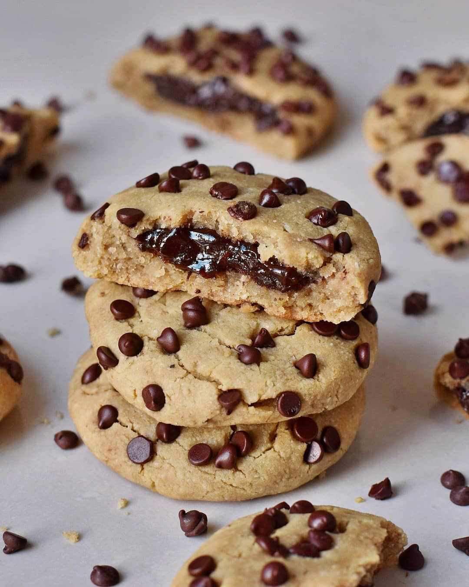

# Check out these chocolate filled choc-chip cookies made with white cannellini beans! 100% plant-based and gluten free, these chewy, high-protein cookies are practically guilt free! 🍪 🌱⠀ 

> recipe by [@pbnfood](https://www.instagram.com/pbnfood/) 
(PBN Food | Vegan Recipes & Food News) - [see original post](https://instagram.com/p/Bq2Axv-D3_q)

⠀  
Tap the link in our bio for the recipe from @elavegan!👆🏼⠀  
.⠀  
.⠀  
.⠀  
.⠀  
.⠀  
.⠀  
.⠀  
.⠀  
.⠀  
.⠀  
\#vegan \#plantbased \#veganfood \#crueltyfree \#vegetarian \#healthyfood \#organic \#vegansofig \#healthy \#govegan \#foodporn  \#foodie \#veganfoodshare \#veganism \#veganlife \#health \#vegansofinstagram \#animalrights \#healthyeating \#foodblogger \#healthylifestyle \#animals⠀  
http://bit.ly/2Q0W0lQ   