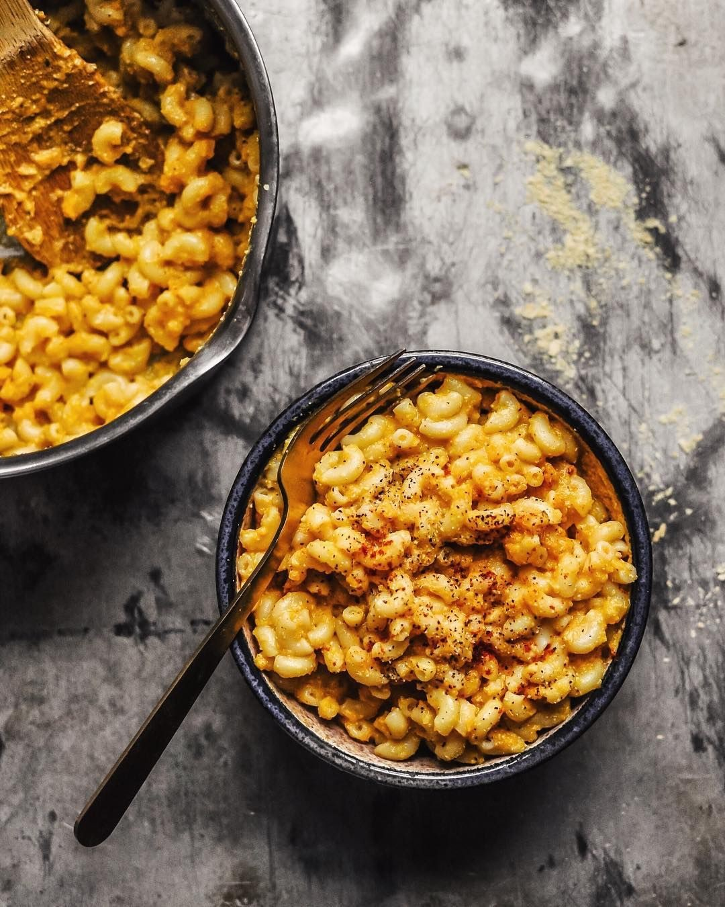

# Check out this plant based take on traditional mac and cheese, made with roasted miso butternut squash 😍 🧀 ⠀ 

> recipe by [@pbnfood](https://www.instagram.com/pbnfood/) 
(PBN Food | Vegan Recipes & Food News) - [see original post](https://instagram.com/p/Bq8IKDyjs1Y)

⠀  
Tap the link in our bio for the recipe from @hannah_chia!👆🏼⠀  
⠀  
⠀  
.⠀  
.⠀  
.⠀  
.⠀  
.⠀  
.⠀  
.⠀  
.⠀  
.⠀  
.⠀  
\#vegan \#plantbased \#veganfood \#crueltyfree \#vegetarian \#healthyfood \#organic \#vegansofig \#healthy \#govegan \#foodporn  \#foodie \#veganfoodshare \#veganism \#veganlife \#health \#vegansofinstagram \#animalrights \#healthyeating \#foodblogger \#healthylifestyle \#animals ⠀  
http://bit.ly/2KEZlkq   