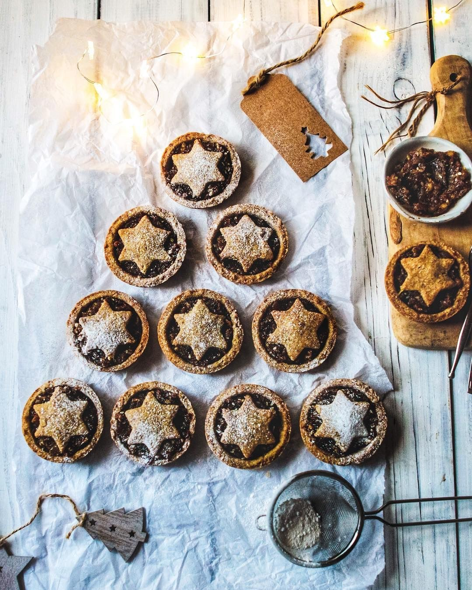

# It’s officially the Christmas season, and what better way to celebrate that by baking these delicious gluten free, 100% plant-based Mince Pies, packed with flavourful fruits and spices! 🥧 🌱⠀ 

> recipe by [@pbnfood](https://www.instagram.com/pbnfood/) 
(PBN Food) - [see original post](https://instagram.com/p/BrXfDuQj7k5)

⠀  
Tap the link in our bio for the recipe from @rebelrecipes!👆🏼⠀  
⠀  
.⠀  
.⠀  
.⠀  
.⠀  
.⠀  
.⠀  
.⠀  
\#vegan \#plantbased \#veganfood \#crueltyfree \#vegetarian \#healthyfood \#organic \#vegansofig \#healthy \#govegan \#foodporn  \#foodie \#veganfoodshare \#veganism \#veganlife \#health \#vegansofinstagram \#animalrights \#healthyeating \#foodblogger \#healthylifestyle \#animals ⠀  
http://bit.ly/2B2gPTw   