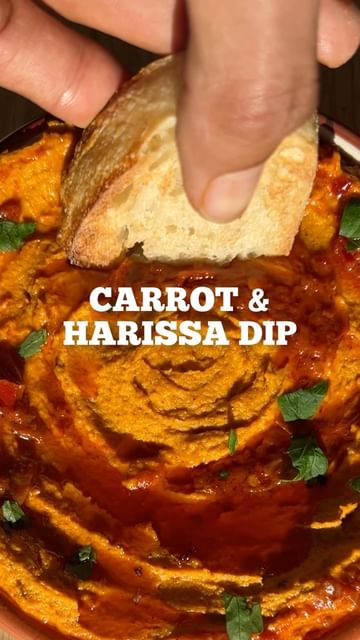

# CARROT + HARISSA DIP 🥕 full written recipe below 👇🏾  

> recipe by [@pengveganmunch](https://www.instagram.com/pengveganmunch/) 
(Jacob) - [see original post](https://instagram.com/p/Cl9G3mfKqQV)

⬇️INGREDIENTS⬇️
- 6 carrots 
- 1 tsp ground cumin 
- 1/2 tsp chilli powder 
- 1 tsp smoked paprika 
- 1 tsp caraway seeds 
-2 tbsp tahini
- juice of 1 lemon 
-olive oil for roasting (2 tbsp for dip)
-2 tsp harissa (2 separate tsp)
- fresh parsley 
- black sesame seeds to garnish 

⬇️METHOD⬇️ 
- peel the carrots and roast them in the spices listed in the ingredients. Roast for around 30mins-1hr at 180°C
- blend the roasted carrots up, along with the juice of a lemon, tahini some oil to combine it all 
-put this in a serving dish then top with a drizzle of harissa and olive oil mixed together 
-finish with fresh chopped parsley, black sesame seeds and enjoy!

\#dip \#dipping \#carrot \#partyfood \#carrots \#carrots🥕 \#sharing \#sharingfood \#sharingrecipe \#veganfood \#veganrecipe \#roastedveggies \#harissa \#chipsanddip \#lazyfood \#ukvegan \#ukfoodie \#londonvegan \#londonfoodie \#easysnack \#snacks \#snacktime \#snackideas 