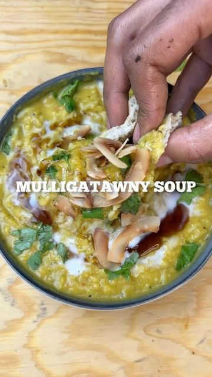

# MULLIGATAWNY SOUP 🇮🇳 a delicious South Indian soup 😊  

> recipe by [@pengveganmunch](https://www.instagram.com/pengveganmunch/) 
(Jacob) - [see original post](https://instagram.com/p/Ck_YoK7qwSb)

  
⬇️INGREDIENTS⬇️  
*For soup base*  
-1/2 tsp cumin seeds   
-1/2 tsp fenugreek seeds  
-1 tsp black pepper corns   
-red chilli  
-1/2 white onion  
-4 garlic cloves   
  
-red chilli  
-1/2 white onion  
-4 garlic cloves   
-1/2 onion   
-2sticks of celery   
-2 carrots   
-1 apple chop   
-1cup lentils   
-1 cup cooked rice  
-3 cups veg stock  
-Coriander  
-Coconut cream  
-toasted coconut flakes  
  
⬇️METHOD⬇️  
-toast dried spices then grind soup base ingredients to paste and fry off then add water   
  
-Fry onion, chilli and celery then add carrots and apple. Once they have cooked down add the soup base, stock and washed lentils.   
  
-Once lentils are cooked blend soup. Stir in cooked rice and coriander. To serve drizzle coconut cream, toasted coconut flakes and coriander.  
  
\#southindian \#southindianfood \#southindianrecipes \#indianfood \#indianrecipes \#lentilsoup \#lentils \#easyrecipe \#winterfood \#easyfood \#soup \#souprecipe \#ricesoup \#tastyfood \#tasty \#india \#indian \#ukvegan \#londonvegan \#vegansoflondon \#vegansofldn \#veganuk   