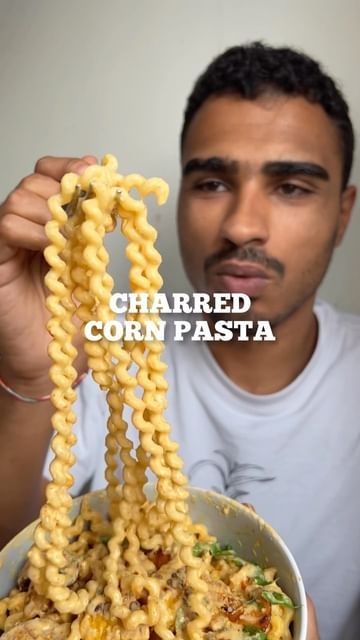

# CHARRED CORN PASTA 🌽 the combination you never knew you needed 🤝 

> recipe by [@pengveganmunch](https://www.instagram.com/pengveganmunch/) 
(Jacob) - [see original post](https://instagram.com/p/ClHCFf8qk1S)

Saw @zenaskitchen make a corn pasta over on @mob and wanted to make a vegan version for myself 😊 

⬇️INGREDIENTS⬇️
-1 large can of sweetcorn
-3 garlic cloves
-1/4 cup nutritional yeast
-handful of soaked cashews (soak in boiling water for minimum 30mins)
-1/4 cup water (add more to loosen)
-1 tsp smoked paprika 
-pinch of salt + pepper

-handful of chestnut mushrooms
-smoked paprika 
-chilli flakes

\#pasta \#pastarecipe \#pastalover \#pastapasta \#pastaaddict \#pastanight \#cornrecipes \#corn \#cornonthecob \#veganrecipes \#veganfood \#ukvegan \#londonvegan \#vegansoflondon \#veganuk \#londonfoodie \#ukfoodie \#foodie \#plantbased \#plantbasedrecipe \#easyrecipes \#easyrecipe 