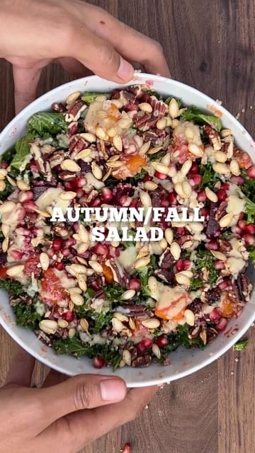

# AUTUMN (🇬🇧) FALL (🇺🇸) SALAD 🥶🥗 a warming, filling salad because I want salad all year round pls 🤝  

> recipe by [@pengveganmunch](https://www.instagram.com/pengveganmunch/) 
(Jacob) - [see original post](https://instagram.com/p/ClLj0TSKbFo)

\
⬇️INGREDIENTS⬇️\
\
-Kale\
-Butternut squash\
-Beetroot \
-Pomegranate seeds \
-Handful of pecans \
\
*For dressing*\
-1/2 cup tahini\
-1 tbsp maple syrup \
-1/2 clove garlic \
-Juice of 1/2 lemon \
-Salt and pepper \
\
⬇️METHOD⬇️\
\
-Chop and roast squash (roast for around 30 minutes @ 200° with a little oil\
-massage the kale with oil and leave to rest/soften for 10/15 minutes.\
-add the pecans and squash seeds to the oven (to toast them) half way through cooking the squash.\
-mix the kale, chopped beetroot and roasted squash then top with pomegranate seeds, roasted squash seeds and pecans. Stir in and top with some dressing and enjoy!\
\
\#salad \#autumnsalad \#autumnfood \#winterrecipes \#squash \#kale \#saladrecipe \#winter \#rootvegetables \#quinoa \#quinoasalad \#autumn \#autumnrecipes \#fallsalad \#fallfood \#fallrecipes \#easyfood \#easyrecipe \#veganfood \#veganrecipes \#ukvegan \#veganuk \#londonvegan \#vegansofldn \#reels \#fyp \#fall 