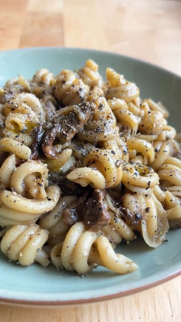

# Sunchoke and Porcini pasta. This one is special; an easy plant-based, umami-rich recipe. A vegan riff on cacio e pepe.  

> recipe by [@pierceabernathy](https://www.instagram.com/pierceabernathy/) 
(Pierce Abernathy) - [see original post](https://instagram.com/p/CdLf8jUpfUV)

\
Sunchokes are the tuberous root of certain types of sunflowers. They are buttery, nutty, sweet and absolutely delicious.\
\
Disclaimer: With this portion size of sunchokes, don't be afraid of the farts (;\
\
Ingredients:\
1/2 lb sunchokes, rinsed and dried \
10 grams dried porcini\
1 tsp salt\
2 cloves garlic, thinly sliced\
2 tbsp olive oil\
Freshly ground coarse black pepper \
Salt to taste\
\
1/2 lb dried pasta \
\
Preparation: \
1. Preheat the oven to 425F/220C. 2. Place sunchokes on a parchment-lined baking sheet and season generously with oil and salt. Bake, rotating every 15 minutes for 45-55 minutes or until tender to the touch. Remove from heat and allow to cool.\
3. In a heat-proof bowl add the dried porcini and cover with 1/2 - 1 cup of water. Allow to sit for at least 20 minutes. Drain, set aside, and reserve liquid for sunchoke sauce.\
4. Peel the skin off of the sunchokes and add to a food processor along with the porcini liquid and 1 tsp salt. Process until smooth, thin sauce forms. Add more water if needed.\
5. Begin cooking dried pasta in heavily salted water. Cook 1 minute before al-dente. \
6. While pasta is cooking, preheat a sauté pan on medium heat and add the porcinis. Cook for 2-3 minutes then add the garlic. Cook for another minute then add in the sunchoke sauce. Stir to bring everything together then add the pasta directly from the salted water along with a ladle or two of pasta water. Toss to combine and season with a generous amount of black pepper and salt to taste. Once the sauce is glossy and sticking to the pasta, remove from heat and serve immediately. \
7. Garnish with good olive oil and more black pepper. 