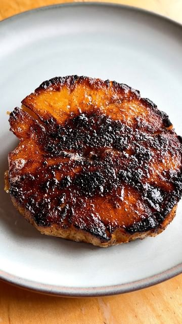

# Celeriac steaks with celery leaf salad. I find the easiest way to cook celeriac is to give it a good scrub and roast it whole with the skin on. From there it can be prepared in a variety of ways. 

> recipe by [@pierceabernathy](https://www.instagram.com/pierceabernathy/) 
(Pierce Abernathy) - [see original post](https://instagram.com/p/Cjs6gLKpYtb)

 