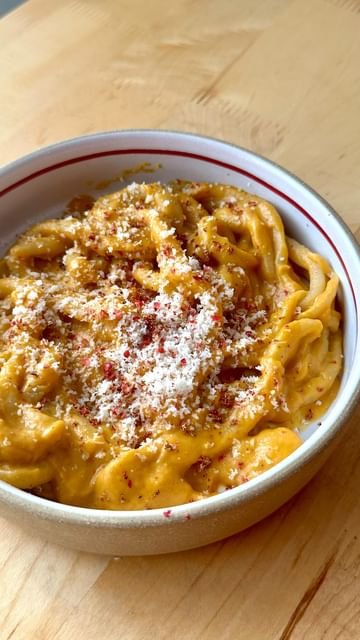

# Homemade Pici with Calabrian Chile Squash Sauce. A hand-rolled Tuscan pasta that is thick and chewy. A highly approachable option if you want to start making your own pasta or roll the longest noodle of your life.  

> recipe by [@pierceabernathy](https://www.instagram.com/pierceabernathy/) 
(Pierce Abernathy) - [see original post](https://instagram.com/p/CncOG3dI0Bc)

  
For the pasta-  
500 gr bread flour  
260 gr lukewarm water  
50 gr extra virgin olive oil  
5 gr salt  
  
For the sauce-  
2 medium size squash  
3 garlic cloves  
1 shallot  
2 tablespoons crushed Calabrian chilies  
Salt (to taste)  
Pasta water  
  
\#pici \#homemadepasta \#squash   