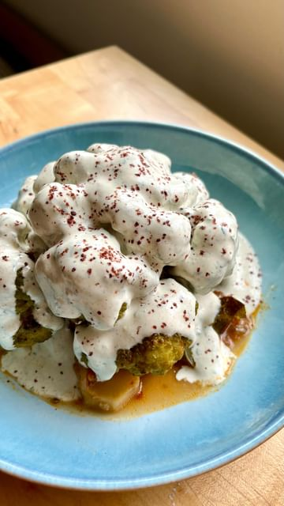

# I got lost in the sauce with this whole braised cauliflower with tarragon mustard labneh.  

> recipe by [@pierceabernathy](https://www.instagram.com/pierceabernathy/) 
(Pierce Abernathy) - [see original post](https://instagram.com/p/Ck_R5tSJDao)

\
Ingredients:\
1 head of cauliflower \
3 tbsp olive oil\
1/2 white onion, sliced\
3 cloves garlic, sliced\
1/2 tsp fennel seeds\
1/2 tsp coriander seeds\
1/2 tsp red pepper flakes \
1 tbsp tomato paste \
1/2 tsp salt\
1 quart water\
\
Tarragon Mustard Labneh//\
2 tbsp dijon mustard\
1/2 cup labneh\
1/2 lemon, juiced\
1/2 tsp salt\
1 tbsp fresh tarragon, finely chopped \
Freshly cracked black pepper \
1-2 tbsp water\
\
Neutral oil\
Salt \
Sumac to garnish\
\
Preparation:\
1. In a large heavy bottomed pot on medium heat add the olive oil and white onion. Cook until translucent and soft, about 5 minutes. Add in the fennel seeds, coriander seeds, and red pepper flakes. Toast for 1-2 minutes. Add in the garlic and cook for 1-2 minutes. Make space in the center of the pan and add in tomato paste. Cook for 1 minute then incorporate into onions, garlic, and spices. Deglaze with 1 quart water.\
2. Add in the cauliflower and cauliflower leaves. Reduce heat to a simmer and cover. Cook for 20-35 minutes, or until cauliflower is tender. \
3. For the Labneh, combine the mustard, labneh, tarragon, salt, lemon juice, black pepper and water. Stir to combine. Taste and adjust seasoning if desired.\
4. Remove cauliflower and transfer to a baking sheet. Continue to cook stems in braising liquid until tender, about another 10 minutes.\
5. Cover the cauliflower with a generous amount of neutral oil and salt. Broil on high for 5-7 minutes or until lightly charred. \
6. Plate the cauliflower stems and leaves and place the cauliflower head on top. Cover with labneh and garnish with sumac. 