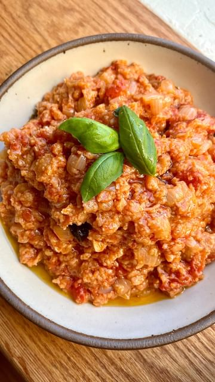

# While traveling in Italy recently I ate Pappa al Pomodoro for the first time. It was life changing. Tuscan stale bread soup with only 8 Ingredients! ( that’s including salt, pepper, and olive oil). I truly have never had something so simple, so affordable and so delicious. This completely vegan dish has the texture and depth of Bolognese. Safe to say I am obsessed.  

> recipe by [@pierceabernathy](https://www.instagram.com/pierceabernathy/) 
(Pierce Abernathy) - [see original post](https://instagram.com/p/ChU8RepsCyO)

\
Ingredients: \
1 28oz can whole peeled tomatoes\
1/4 cup olive oil plus more to garnish \
1/2 white onion, chopped\
2 cloves garlic, grated\
Handful of Basil\
Salt and pepper to taste\
6-7 ounces of stale bread 