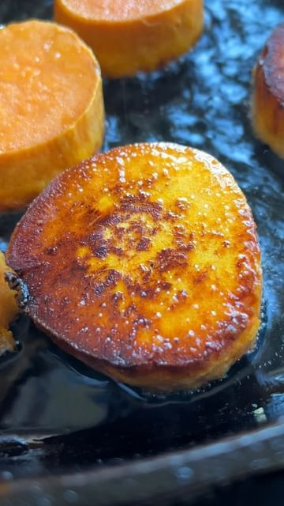

# Sweet Potato, peppers and cucumber with corn-infused tahini. A seasonal variety of seared and stir-fried veggies with a rich balanced sauce. Stir fried cucumbers are common in Chinese and Korean cuisine. They soften slightly while still holding a lot of moisture giving the dish a refreshing juicy crunch. I absolutely love the taste of raw juiced corn. It’s sweet, a bit nutty, and a perfect partner to tahini.  

> recipe by [@pierceabernathy](https://www.instagram.com/pierceabernathy/) 
(Pierce Abernathy) - [see original post](https://instagram.com/p/ChkXvnQJAAH)

\
I teamed up with @seed to highlight microbiome-friendly foods, like sweet potato and corn (in this recipe)! Foods that are fiber-rich and/or good for your gut. By diversifying the number of fruits and vegetables you consume you're incorporating plenty of macro- and micronutrients that support your microbiome. \
\
Another great way is to incorporate @Seed’s DS-01™ Daily Synbiotic into your routine like me. DS-01™ is a pre-and-probiotic containing 24 clinically-and-scientifically studied strains (and 53.6 billion AFU) for benefits in and beyond the gut. \
\
\#sciencesnack \#seedpartner \#accountable 