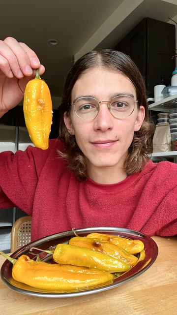

# It’s almost November and there’s somehow still peppers at the farmers market. 

> recipe by [@pierceabernathy](https://www.instagram.com/pierceabernathy/) 
(Pierce Abernathy) - [see original post](https://instagram.com/p/CkJNXKYtMth)

\
These stuffed peppers are one of my favorite appetizers. So easy to riff on and a treat to eat.\
\
Ingredients:\
Sweet or mild peppers, approx 2oz each\
1/4 cup olive oil\
1 14.oz can of artichoke hearts, drained and chopped \
1 shallot, diced \
2 cloves garlic, minced\
1 cup breadcrumbs\
3/4 cup chopped parsley\
Zest of 1 lemon\
Juice of 1/2 lemon\
2 tsp capers\
1/3 cup freshly grated parmesan\
Anchovies (optional)\
\
Preparation:\
1. Preheat the oven to 375F/190C.\
2. Place peppers on a parchment lined baking sheet and season generously with olive oil and salt. Bake for 20 minutes and set aside.\
3. While the peppers are baking make the filling. Preheat a cast iron pan on medium heat with 1/4 cup olive oil. Add in the shallots and cook until translucent, about 3-5 minutes. Add in the artichokes and cook for an additional 3-5 minutes. Add in the breadcrumbs and cook until golden brown, about 6-8 minutes. Add in the garlic and cook for an additional 2-3 minutes or until fragrant. Transfer to a mixing bowl and add in the chopped parsley, lemon zest and juice, capers, and freshly grated parmesan. Taste and adjust for salt if needed.\
4. Once peppers are cool enough to handle, make a small slit in the middle of the pepper and evenly stuff with the filling, making sure to push mixture to top and bottom of pepper. If desired, add in an anchovy as well. Clean up any filling on the outside of the pepper and serve with seam side down.\
5. Garnish with more olive oil and flaky salt. 