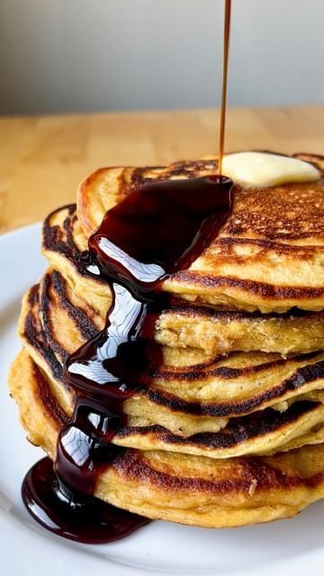

# Super Fluffy Squash pancakes with ginger-date syrup.  

> recipe by [@pierceabernathy](https://www.instagram.com/pierceabernathy/) 
(Pierce Abernathy) - [see original post](https://instagram.com/p/ClZD36srFpW)

  
This is a great way to use up any leftover squash. Whipping your egg whites and incorporating them in at the last minute ensure an airy batter resulting in fluffy decadent pancakes. Do not skip the syrup.   
  
Ingredients:  
Pancakes//  
275 grams flour   
1/2 tsp baking soda  
1 tsp baking powder  
1/2 tsp salt   
1/2 tsp cinnamon  
1/4 tsp nutmeg  
1/4 tsp allspice   
42 grams sugar  
285 grams squash  
1 egg yolk  
2 egg whites  
490 grams buttermilk  
43 grams butter  
  
Syrup//  
1/4 cup maple syrup   
2 tbsp date molasses  
1 inch piece ginger, chopped  
  
1. Preheat the oven to 400F/200C.   
2. Cut squash in half, remove seeds, and season with olive oil and a pinch of salt. Place squash skin side up and roast until extremely tender, about 40 minutes. Allow to cool.  
3. In a mixing bowl combine all the dry ingredients and stir to combine. Set aside.  
4. In another mixing bowl combine the egg yolk, roasted squash, buttermilk, and butter. Mix and add to the dry ingredients.  
5. Whip the egg whites in a bowl until stiff peaks form. Add into the pancake batter and carefully and slowly fold into the batter. Let the batter rest for 10 minutes.  
6. Preheat a large pan on medium heat. Add 1 tsp butter and pour in 1/2 cup pancake batter. Cook on one side until bubbles form, about 2-3 minutes. Flip and cook for an additional 2-3 minutes. Keep pancakes warm in an oven until all the remaining batter is used.   
7. For the syrup, Bring a nonstick pan to medium-low heat and add the maple syrup, date molasses, and ginger. Cook for 7-8 minutes or until ginger is soft. Strain into a heatproof bowl.   
  
\#pancakes \#breakfast \#leftovers   