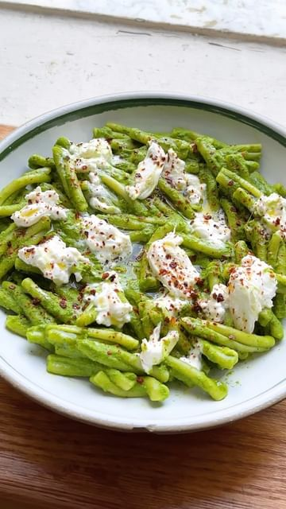

# Greens are everywhere at the market and I’ve been buying dandelions non-stop. Slightly bitter, a bit earthy and packed full of nutrients I think they lend themselves perfectly to a simple pasta sauce. Feel free to use spinach, chard, mustard, kale, or any other greens you can get your hands on.  

> recipe by [@pierceabernathy](https://www.instagram.com/pierceabernathy/) 
(Pierce Abernathy) - [see original post](https://instagram.com/p/Cs6jcweO2z1)

  
Ingredients:  
1 lb dandelion greens   
5 cloves garlic   
Juice of 1 lemon  
6 anchovies  
1/4 cup olive oil  
1/2 tsp red pepper flakes  
Salt to taste  
  
Pasta of your choice (1lb for this portion of sauce)  
Buratta to garnish  
Red pepper flakes to garnish  
Olive oil to garnish   
  
Preparation:  
1. Bring a large pot of salted water to a boil. Add in the dandelion greens and garlic and cook until stems are softened, about 4-5 minutes. Transfer to an ice bath to cool and drain.  
2. Transfer greens and garlic to a blender along with the lemon juice, anchovies, olive oil, and red pepper flakes. Blend until smooth. Taste and adjust salt if desired.  
3. Cook pasta al dente per package instructions. Transfer to a large mixing bowl with some of the pasta cooking water. Add in the sauce and toss to coat. Garnish with Buratta, red pepper flakes, and olive oil.   